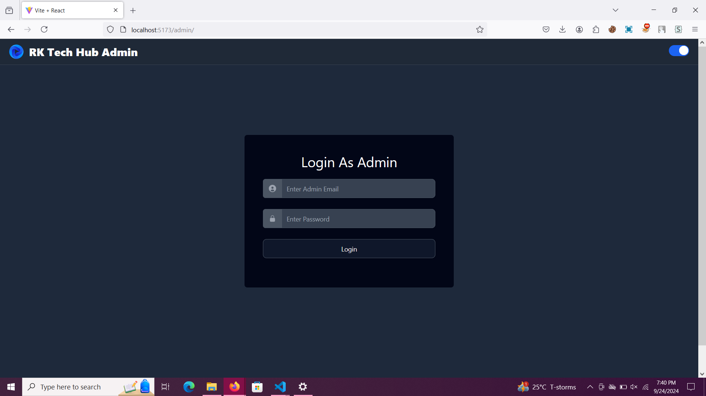
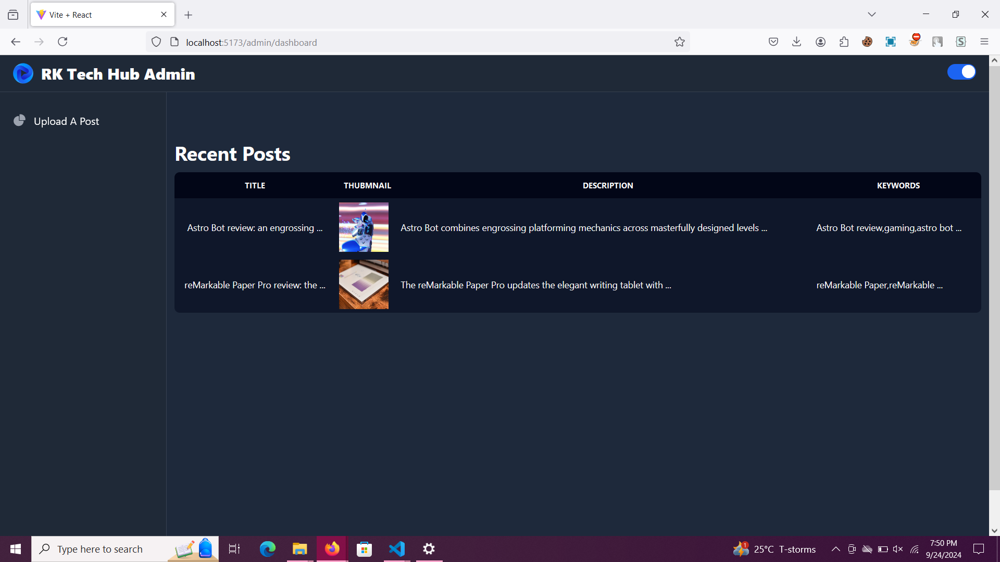
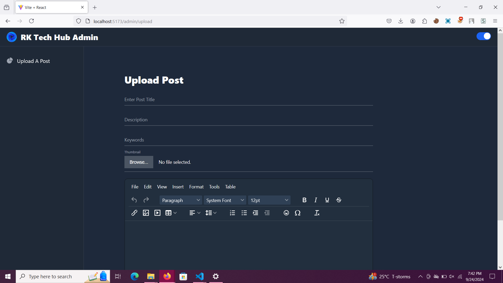
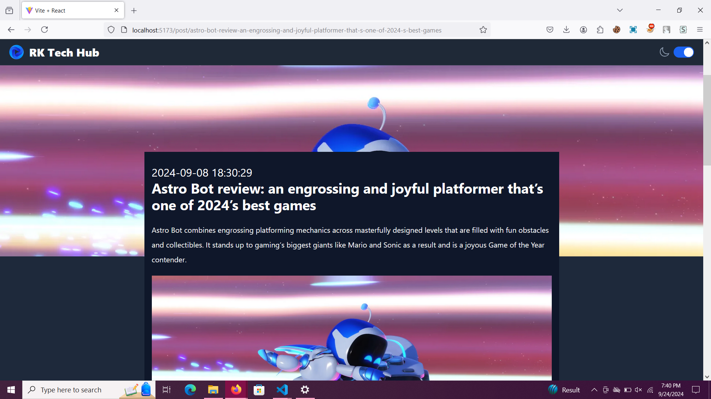
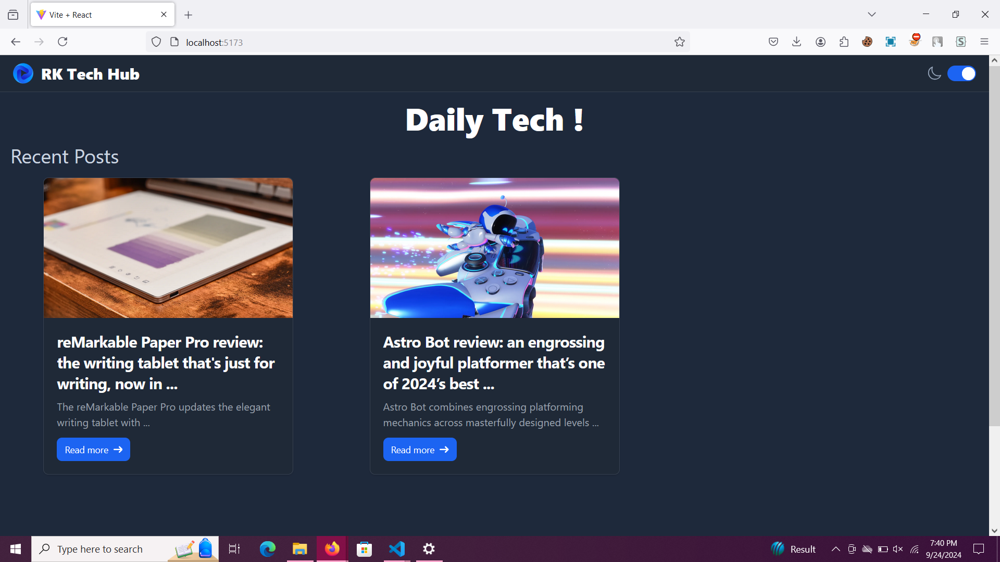

# Blogging Site (React)

## Project Overview

This project is a simple blogging site built using React. It features an admin panel where authorized users can log in, create and manage blog posts. The frontend is powered by React, with a secure backend for user authentication and blog management.
## Outputs

## Features

- **Admin Login:**
  - Secure login system for admin users.

  - Error handling for incorrect login attempts.

- **Post Management:**
  - Admins can create new blog posts.
  - Posts include title, content, and an optional featured image.
  - Admins can edit and delete existing posts.
  - Posts are displayed in a feed for all users to read.

- **User Interface:**
  - Clean and responsive design using modern CSS (Tailwind or custom styles).
  - Easy navigation between the blog feed and the admin panel.

## Technologies Used

- **Frontend:**
  - React (Hooks, Functional Components)
  - React Router (for routing between pages)
  - Axios (for API requests)
  - CSS (Tailwind or custom CSS)

